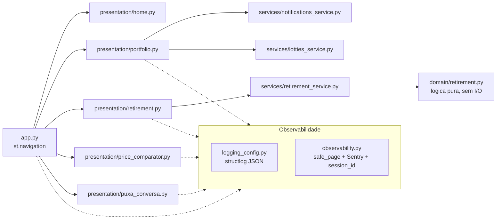

# Portfolio via Streamlit

Portfolio pessoal em Streamlit: bio + uma colecao de mini-apps de dados
(simulador de aposentadoria, comparador de precos, cartas de perguntas).

## Arquitetura



Camadas, de dentro para fora:

- **`domain/`** — logica de negocio pura (ex: calculo de aposentadoria).
  Sem Streamlit, sem I/O. E o que permite testar exaustivamente, inclusive
  com property-based testing (Hypothesis), sem precisar simular UI.
- **`services/`** — I/O: chamadas HTTP, leitura de assets, cache
  (`st.cache_data`). Valida entrada crua contra os modelos Pydantic de
  `domain/` e delega o calculo.
- **`presentation/`** — paginas Streamlit. Nao deveria conter regra de
  negocio, so orquestracao de widgets e chamadas a `services/`.
- **`config.py`** — configuracao tipada e validada (pydantic-settings).
- **`logging_config.py` + `observability.py`** — logging estruturado (JSON),
  correlacao por `session_id`, error boundary por pagina (`@safe_page`),
  integracao opcional com Sentry e PostHog.

## Rodando localmente

Este projeto usa [`uv`](https://docs.astral.sh/uv/) para gerenciar
dependencias.

```bash
curl -LsSf https://astral.sh/uv/install.sh | sh
uv sync --group dev
cp .streamlit/secrets.toml.example .streamlit/secrets.toml
uv run streamlit run app.py
```

## Testes e qualidade

```bash
uv run pytest
uv run ruff check .
uv run ruff format .
uv run mypy Portfolio_via_Streamlit/domain Portfolio_via_Streamlit/services
uv run bandit -c pyproject.toml -r Portfolio_via_Streamlit
uv run pip-audit
uv run pre-commit install
```

Tudo isso tambem roda no CI (`.github/workflows/ci.yml`) em cada PR.

## Observabilidade

- **Logs**: JSON estruturado no stdout (via `structlog`), capturado
  nativamente pelo Render. Cada linha carrega `session_id` e `page`.
- **Erros**: cada pagina e protegida por `@safe_page`, que loga a excecao
  completa e mostra uma mensagem amigavel ao usuario. Se `SENTRY_DSN`
  estiver configurado, o erro tambem e reportado ao Sentry.
- **Analytics de produto**: opcional, via PostHog (`POSTHOG_API_KEY`).
- **Uptime**: aponte um servico externo (UptimeRobot, BetterStack) para
  `GET /_stcore/health`.

## Deploy

Via Docker (`Dockerfile`) ou `render.yaml`. Ver `CHANGELOG.md` para o
historico completo do refactor.
